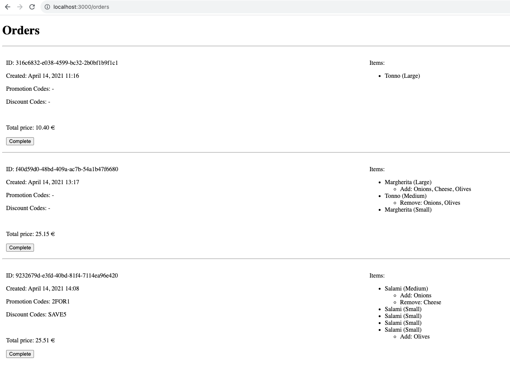

# SOLUTION

Here is the solution to the problem described in Readme.

A Rails app has two main features:

- displaying a list of orders. Orders are loaded from the `data/orders.json` file.
- the ability to complete an order. Click the 'Complete' button for that.

Promotions and discounts are **not currently implemented** as I limited time to recommended 4h.



## Installation

  1. Clone the repository to your local machine:
  ```git clone <repository_url>```

  2. Install the necessary dependencies using Bundler:

  ```bundle install```

  3. Precompile JS

  ```bundle exec rake assets:precompile```

## Usage

  To run the app, follow these steps:

  1. Start the Rails server:

  ```rails server```

  2. Access the application in your web browser at `http://localhost:3000`.


## Implementation details

I generated a project using `Rails new`, it has created a lot of bootstrap changes, sorry about that.

### Data loader

Data persistence functionality lives in a separate `DataLoader` module.

### Completion of the order
  
`PATCH` request is sent from frontend using JS `fetch`. After successful completion of the operation on the backend JS redirects to `/orders` page with updated data.
Backend updates the `state` attribute of the order to `completed` and persists the state in the data file. The controller `complete` action handles that.

### Price calculation

Controller fetches orders from JSON file and calculates total prices in memory. 
Price calculation is abstracted in the `PizzaOrderService` which is simply called from the controller.
A service object is initialized with config data parsed inside the controller.

The service is responsible for calculating the price for a single pizza, extras, and total order price.
It encapsulates business logic for calculating prices.
Ideally, we would save the calculated prices to the DB, so that we only need to calculate once.

I use the `Money` format for prices for avoiding rounding/precision issues and for having currency together with the price.

### Tests

`rspec` is used for testing. There are two fixtures for files with test data.

Run tests:

  ```rspec```


## Next steps

- implement promotions and discounts
- consider persisting the prices in the file/DB
- better error handling on all the layers
- figure out credentials.yml
- improve the configuration of data files for different environments + test data
- specs improvements: shared examples, remove magic numbers, request tests
- various TODOs in the code
- clean up files autogenerated by Rails new
